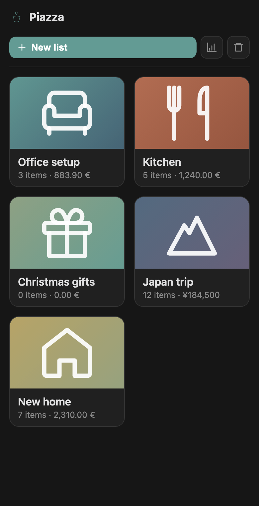
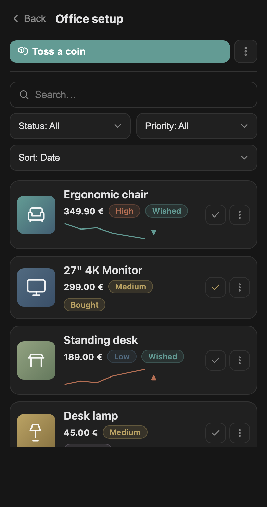
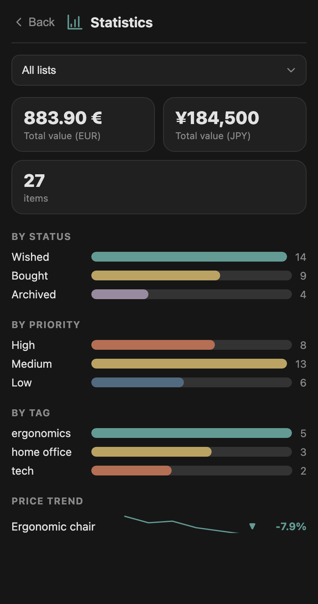
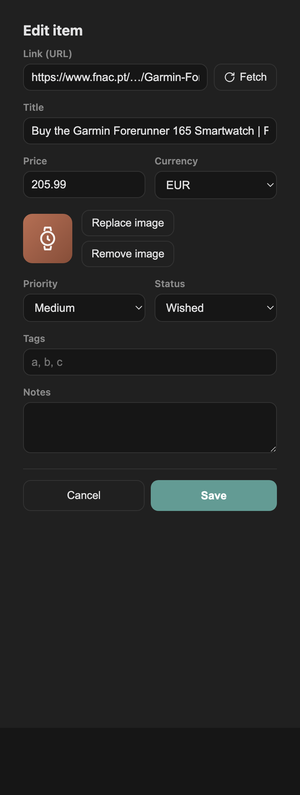

<!-- LANG-NAV -->
[English](README.md) · [Português](README.pt.md) · [Español](README.es.md) · [Deutsch](README.de.md) · **Français** · [Italiano](README.it.md)

# 🪙 Trevi

> Un gestionnaire de listes de souhaits pour Obsidian. Jetez une pièce dans la fontaine et faites un vœu — chaque vœu est un article conservé dans votre propre coffre. Aucune fonctionnalité sociale, aucune IA : local, portable et élégant.

Trevi transforme votre coffre en une collection personnelle de listes de souhaits. Créez des listes nommées, ajoutez des articles avec une photo, un prix et un lien, conservez un historique des prix, et visualisez le tout sur un tableau de bord SVG léger — le tout stocké dans de simples fichiers que vous possédez entièrement et qui se synchronisent trivialement entre appareils, téléphone compris.

## Fonctionnalités

- **Piazza** — un écran d'accueil présentant chaque liste sous forme de carte (couverture, nombre d'articles, valeur totale).
- **Listes et articles** — CRUD complet, recherche textuelle, filtres (statut, priorité, étiquette) et tri (prix, priorité, date, titre). Touchez un article pour l'ouvrir.
- **« Jeter une pièce »** — le flux d'ajout d'article, avec **capture de métadonnées depuis une URL** (Open Graph + JSON-LD, récupérées via le `requestUrl` d'Obsidian, ce qui fonctionne sur mobile et contourne le CORS), et saisie manuelle comme solution de repli.
- **Images** — stockées dans un dossier à plat, nommées par UUID, référencées uniquement par UUID dans le fichier de données. Ajoutez-les depuis votre appareil ou téléchargez-les depuis une URL.
- **Prix** — mises à jour manuelles uniquement (par article ou toutes en même temps). Chaque modification s'ajoute à un historique des prix qui alimente des sparklines de tendance.
- **Statistiques** — totaux par devise, décomptes par statut/priorité/étiquette, et tendances de prix. Limitez le tableau de bord à toutes les listes ou à une seule.
- **Couverture de liste** — définissez la couverture d'une liste à partir d'une image de votre appareil ou de la photo de n'importe quel article.
- **Déplacer · Dupliquer · Marquer comme acheté · Ouvrir le lien · Exporter** — à un toucher de chaque article, ou depuis le menu d'une liste.
- **Export vers Markdown** — transformez n'importe quelle liste en une note contenant un tableau de ses articles.
- **Corbeille** — suppression sûre et récupérable avec une fenêtre de rétention configurable ; restaurez ou purgez ; les images orphelines ne sont nettoyées que lorsque vous le demandez.
- **Palette** — la palette « Trevi » apaisante ainsi que des préréglages (Travertino, Acquamarina, Notturno) et des remplacements couleur par couleur. La couleur n'est appliquée qu'aux données ; tout le reste hérite de votre thème, en clair et en sombre.
- **Sauvegardes et récupération** — écritures atomiques, un `.bak`, instantanés quotidiens rotatifs, récupération automatique depuis la sauvegarde lisible la plus récente, et un mode sans échec en lecture seule qui n'écrase jamais les données illisibles.
- **Internationalisation** — English, Português, Español, Deutsch, Français, Italiano.
- **Accessible et mobile-first** — navigable au clavier, adapté au thème, responsive jusqu'à la largeur d'un téléphone.

## Captures d'écran

  
  
  
  

## Prise en main

**Installation manuelle**

1. Copiez `main.js`, `manifest.json` et `styles.css` dans `<your vault>/.obsidian/plugins/trevi/`.
2. Dans Obsidian : Paramètres → Modules complémentaires → activez **Trevi**.

**BRAT (bêta)**

Ajoutez le dépôt dans le plugin BRAT pour recevoir les mises à jour sans copie manuelle.

**Modules complémentaires communautaires**

Une fois répertorié, installez-le depuis Paramètres → Modules complémentaires → Parcourir.

## Utilisation

1. Ouvrez **Trevi** depuis le ruban (l'icône de la fontaine) ou la palette de commandes (`Trevi: Open Piazza`).
2. Créez une liste, puis **Jetez une pièce** pour ajouter un article — collez l'URL d'un produit et appuyez sur **Récupérer**, ou remplissez-le à la main.
3. Touchez un article pour le modifier ; utilisez le menu **⋯** d'un article pour ouvrir son lien, mettre à jour son prix, le déplacer, le dupliquer, le définir comme couverture de la liste, ou le supprimer.
4. Utilisez le menu **⋯** de la liste pour définir une couverture, renommer, exporter vers Markdown, ou supprimer.
5. Ouvrez **Statistiques** pour les totaux et les tendances de prix.

## Données, stockage et confidentialité

- **Source unique de vérité** : un fichier JSON dans votre coffre (par défaut `core/trevi/trevi.json`), écrit de manière atomique.
- **Images** : un dossier à plat (par défaut `core/trevi/assets`), un fichier par UUID.
- **Aucun réseau sauf sur votre action** : les seules requêtes sont les récupérations de métadonnées/prix/images que vous déclenchez, toutes via `requestUrl`. Aucune télémétrie, aucune tâche en arrière-plan, aucun compte.
- **Aucune IA, aucune fonctionnalité sociale** — aucune recommandation, aucun partage, aucune réservation ni cadeau.
- Les deux chemins sont configurables dans les Paramètres ; les modifier migre vos données existantes en toute sécurité.

## Sauvegardes et récupération

- Chaque enregistrement conserve un `.bak` et, une fois par jour, un instantané daté rotatif (les cinq plus récents sont conservés).
- Au démarrage, Trevi charge le fichier lisible le plus récent, en essayant `trevi.json` → `.bak` → instantanés quotidiens.
- Si tout est illisible, Trevi passe en **mode sans échec en lecture seule** et n'écrase jamais vos fichiers, afin que vous puissiez les récupérer à la main.
- S'il détecte des fichiers de conflit de synchronisation dans le dossier de données, il vous avertit.

## Paramètres

| Paramètre | Ce qu'il fait |
|---|---|
| Fichier de données | Chemin du JSON dans votre coffre (déplace les données existantes en cas de modification). |
| Dossier d'images | Emplacement de stockage des images, par UUID (déplace les images existantes en cas de modification). |
| Devise par défaut | Code ISO 4217 utilisé pour les nouveaux articles. |
| Langue | Langue de l'interface (6 prises en charge). |
| Rétention de la corbeille (jours) | Durée pendant laquelle les articles supprimés restent récupérables. |
| Amorcer le prix initial | Enregistrer la première entrée de prix lors de la création d'un article, afin que les tendances disposent de données. |
| Palette | Préréglage + remplacement couleur par couleur pour les couleurs des graphiques. |
| Nettoyer les images orphelines | Supprimer les images non référencées — uniquement lorsque vous le demandez. |

## Compatibilité

- **Bureau et mobile.** `isDesktopOnly` est `false` ; le plugin n'utilise aucun module Node, et toutes les communications réseau passent par `requestUrl`.
- Les graphiques sont des SVG dessinés à la main qui héritent des variables de votre thème et fonctionnent en clair et en sombre.

## Développement

Trevi est livré sous la forme d'un unique `main.js` écrit à la main (plus `manifest.json` et `styles.css`) — aucune étape de compilation requise. La spécification fonctionnelle se trouve dans `trevi-spec.md`.

## Non-objectifs

- Aucune fonctionnalité sociale (partage, réservations de cadeaux, père Noël secret, cadeaux en argent).
- Aucune IA (recommandations, découverte, génération de contenu).
- Aucun processus en arrière-plan — rien ne s'exécute lorsqu'Obsidian est fermé.

## Licence

[MIT](LICENSE) © Fagner Candido
