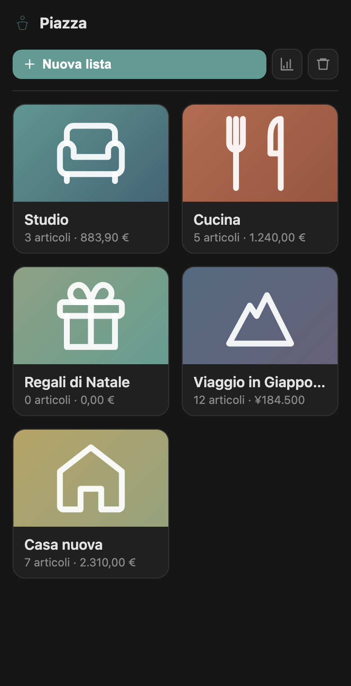
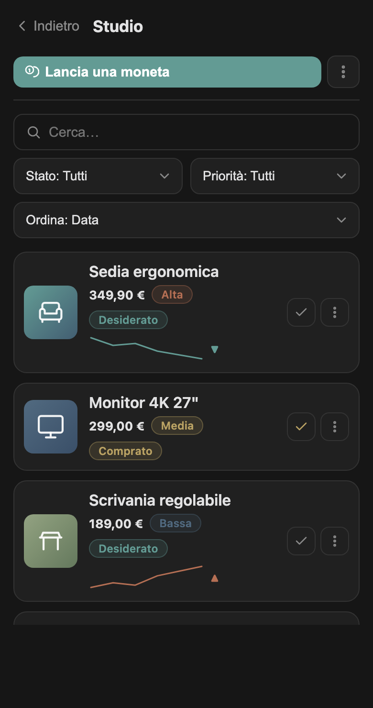
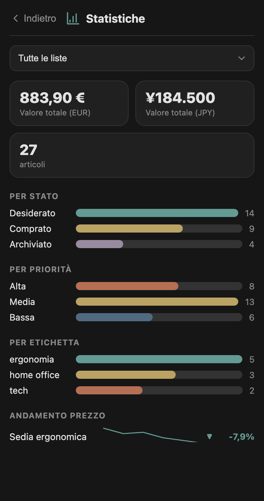
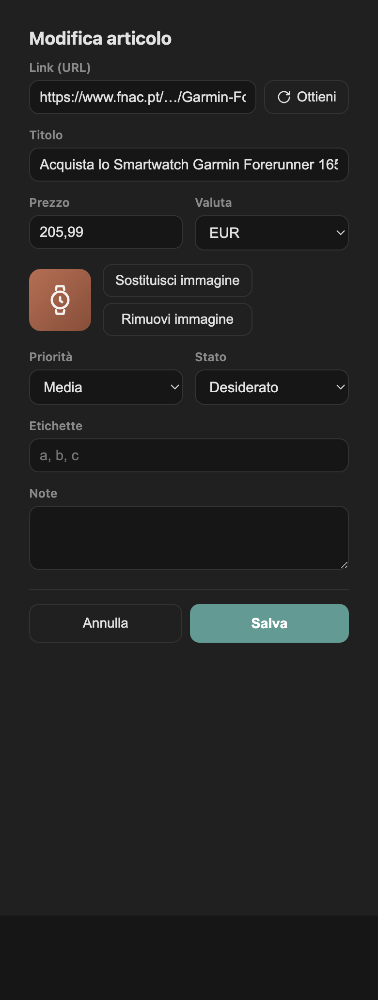

<!-- LANG-NAV -->
[English](README.md) · [Português](README.pt.md) · [Español](README.es.md) · [Deutsch](README.de.md) · [Français](README.fr.md) · **Italiano**

# 🪙 Trevi

> Un gestore di liste dei desideri per Obsidian. Getta una moneta nella fontana ed esprimi un desiderio — ogni desiderio è un elemento conservato nel tuo vault. Nessuna funzione social, nessuna IA: locale, portatile ed elegante.

Trevi trasforma il tuo vault in una collezione personale di liste dei desideri. Crea liste con un nome, aggiungi elementi con foto, prezzo e link, mantieni uno storico dei prezzi e vedi tutto in una dashboard SVG leggera — con ogni cosa conservata in semplici file che possiedi interamente e che si sincronizzano senza sforzo tra i dispositivi, telefono incluso.

## Funzionalità

- **Piazza** — una schermata iniziale con ogni lista come scheda (copertina, numero di elementi, valore totale).
- **Liste ed elementi** — CRUD completo, ricerca testuale, filtri (stato, priorità, tag) e ordinamento (prezzo, priorità, data, titolo). Tocca un elemento per aprirlo.
- **"Getta una moneta"** — il flusso di aggiunta di un elemento, con **acquisizione dei metadati da un URL** (Open Graph + JSON-LD, recuperati tramite `requestUrl` di Obsidian, così funziona su mobile e aggira il CORS), e inserimento manuale come alternativa.
- **Immagini** — conservate in una cartella piatta, denominate tramite UUID e referenziate solo tramite UUID nel file di dati. Aggiungile dal tuo dispositivo o scaricale da un URL.
- **Prezzi** — solo aggiornamenti manuali (per singolo elemento o tutti in una volta). Ogni modifica viene aggiunta a uno storico dei prezzi che alimenta le sparkline di tendenza.
- **Statistiche** — totali per valuta, conteggi per stato/priorità/tag e andamento dei prezzi. Limita la dashboard a tutte le liste o a una sola.
- **Copertina della lista** — imposta la copertina di una lista da un'immagine del dispositivo o dalla foto di un qualsiasi elemento.
- **Sposta · Duplica · Segna come acquistato · Apri link · Esporta** — a un tocco di distanza da ogni elemento o dal menu di una lista.
- **Esporta in Markdown** — trasforma qualsiasi lista in una nota con una tabella dei suoi elementi.
- **Cestino** — eliminazione sicura e recuperabile con una finestra di conservazione configurabile; ripristina o elimina definitivamente; le immagini orfane vengono ripulite solo su tua richiesta.
- **Palette** — la palette "Trevi" pacata più i preset (Travertino, Acquamarina, Notturno) e le personalizzazioni per singolo colore. Il colore viene applicato solo ai dati; tutto il resto eredita il tuo tema, in chiaro e scuro.
- **Backup e ripristino** — scritture atomiche, un file `.bak`, snapshot giornalieri a rotazione, ripristino automatico dal backup leggibile più recente e una modalità sicura di sola lettura che non sovrascrive mai i dati illeggibili.
- **Internazionalizzazione** — English, Português, Español, Deutsch, Français, Italiano.
- **Accessibile e mobile-first** — navigabile da tastiera, adattivo al tema, responsive fino alla larghezza di un telefono.

## Screenshot

  
  
  
  

## Per iniziare

**Installazione manuale**

1. Copia `main.js`, `manifest.json` e `styles.css` in `<il tuo vault>/.obsidian/plugins/trevi/`.
2. In Obsidian: Impostazioni → Plugin della community → abilita **Trevi**.

**BRAT (beta)**

Aggiungi il repository nel plugin BRAT per ricevere aggiornamenti senza una copia manuale.

**Plugin della community**

Una volta pubblicato nell'elenco, installalo da Impostazioni → Plugin della community → Sfoglia.

## Utilizzo

1. Apri **Trevi** dalla barra laterale (l'icona della fontana) o dalla tavolozza dei comandi (`Trevi: Open Piazza`).
2. Crea una lista, poi **Getta una moneta** per aggiungere un elemento — incolla l'URL di un prodotto e premi **Recupera**, oppure compilalo a mano.
3. Tocca un elemento per modificarlo; usa il menu **⋯** su un elemento per aprire il suo link, aggiornarne il prezzo, spostarlo, duplicarlo, impostarlo come copertina della lista o eliminarlo.
4. Usa il menu **⋯** della lista per impostare una copertina, rinominarla, esportarla in Markdown o eliminarla.
5. Apri **Statistiche** per i totali e l'andamento dei prezzi.

## Dati, archiviazione e privacy

- **Fonte unica di verità**: un unico file JSON nel tuo vault (predefinito `core/trevi/trevi.json`), scritto in modo atomico.
- **Immagini**: una cartella piatta (predefinito `core/trevi/assets`), un file per UUID.
- **Nessuna rete se non su tua azione**: le uniche richieste sono i recuperi di metadati/prezzi/immagini che avvii tu, tutti tramite `requestUrl`. Nessuna telemetria, nessun processo in background, nessun account.
- **Nessuna IA, nessuna funzione social** — nessun consiglio, condivisione, prenotazione o regalo.
- Entrambi i percorsi sono configurabili nelle Impostazioni; modificarli migra in sicurezza i tuoi dati esistenti.

## Backup e ripristino

- Ogni salvataggio conserva un file `.bak` e, una volta al giorno, uno snapshot datato a rotazione (vengono mantenuti i cinque più recenti).
- All'avvio Trevi carica il file leggibile più recente, provando `trevi.json` → `.bak` → snapshot giornalieri.
- Se tutto è illeggibile, Trevi entra in una **modalità sicura di sola lettura** e non sovrascrive mai i tuoi file, così puoi recuperarli a mano.
- Se rileva file di conflitto di sincronizzazione nella cartella dei dati, ti avvisa.

## Impostazioni

| Impostazione | Cosa fa |
|---|---|
| File di dati | Percorso del JSON nel tuo vault (sposta i dati esistenti quando viene modificato). |
| Cartella immagini | Dove vengono conservate le immagini, per UUID (sposta le immagini esistenti quando viene modificata). |
| Valuta predefinita | Codice ISO 4217 usato per i nuovi elementi. |
| Lingua | Lingua dell'interfaccia (6 supportate). |
| Conservazione del cestino (giorni) | Per quanto tempo gli elementi eliminati restano recuperabili. |
| Inizializza il prezzo iniziale | Salva la prima voce di prezzo quando crei un elemento, così l'andamento ha dei dati. |
| Palette | Preset + personalizzazione per singolo colore per i colori dei grafici. |
| Pulisci immagini orfane | Rimuove le immagini non referenziate — solo su tua richiesta. |

## Compatibilità

- **Desktop e mobile.** `isDesktopOnly` è `false`; il plugin non usa moduli Node e tutta la rete passa attraverso `requestUrl`.
- I grafici sono SVG disegnati a mano che ereditano le variabili del tuo tema e funzionano in chiaro e scuro.

## Sviluppo

Trevi viene distribuito come un unico `main.js` scritto a mano (più `manifest.json` e `styles.css`) — non è richiesto alcun passaggio di build. La specifica funzionale si trova in `trevi-spec.md`.

## Obiettivi esclusi

- Nessuna funzione social (condivisione, prenotazione di regali, secret santa, regali in denaro).
- Nessuna IA (consigli, scoperta, generazione di contenuti).
- Nessun processo in background — nulla viene eseguito mentre Obsidian è chiuso.

## Licenza

[MIT](LICENSE) © Fagner Candido
